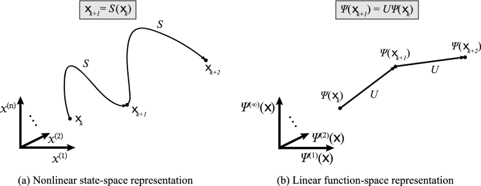

# Koopman-Spectral-analysis
Koopman Spectral analysis is an emerging non linear data analysis algorithm which is used for Sequence modeling. One of the powerful practical use of Koopman operator is Dynamic Mode Decomposition(DMD)[1].

